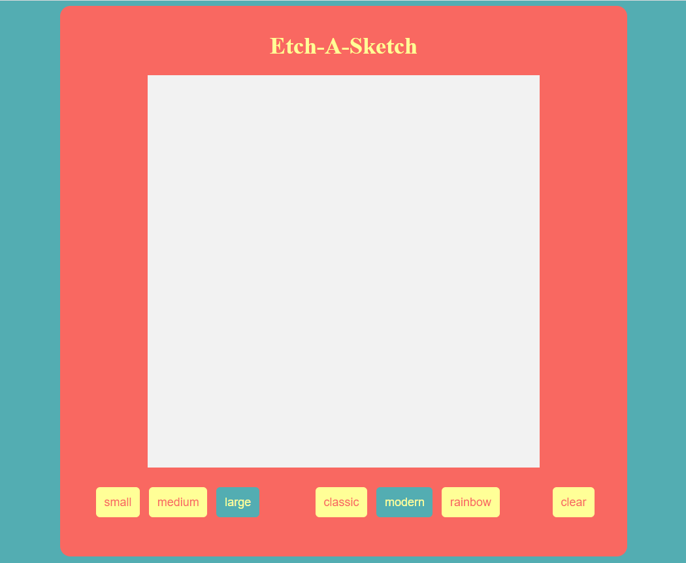

# etch-a-sketch

[Live Demo](https://mrespicio.github.io/etch-a-sketch/)

## Preview

## Project Goals
Create an Etch-A-Sketch web application using HTML, CSS, and Javascript.

## Built With
### Technologies
* HTML
* CSS
* JavaScript
### Tools
* Git and Github
* Sublime Text
* Ubuntu Terminal

## New Skills 
* More practice with DOM manipulation and events
* Use CSS Grid to create a grid and formatting elements on a page
* Use the mouseover event listener to give functionality to the game
* Add styles to dom elements by assigning them a class under specific conditions

## Reflection
Creating this Etch-A-Sketch project challenged me in many ways but also taught me many new skills. I gained a better understanding of DOM manipulation and events. Due to the many amount of options available - different sizes and styles - I was able to explore new ways of approaching and solving problems I came across.

## Misc
This project was created as an assignment for [The Odin Project](https://www.theodinproject.com/lessons/foundations-etch-a-sketch)
Completed: Feb 2023